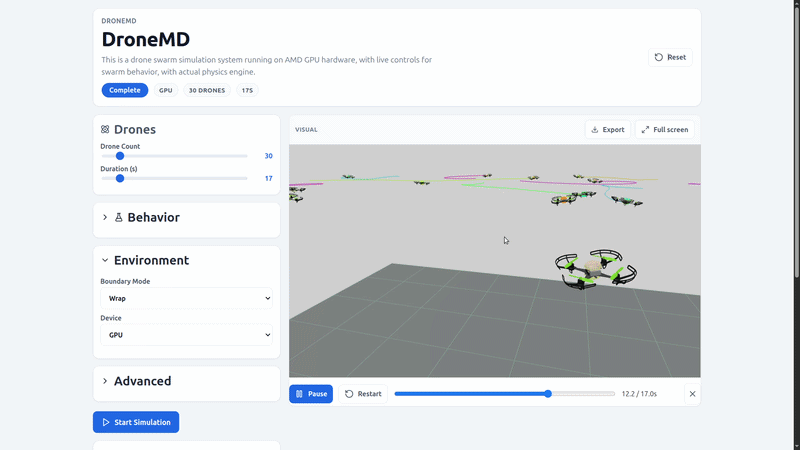

# DroneMD

GPU-accelerated drone swarm simulation platform with physics-accurate Boids flocking, running on AMD Instinct accelerators via JAX ROCm / MuJoCo.

Built for the **AMD Developer Hackathon: Stage II** (lablab.ai).

<p align="center">
  
</p>

## Overview

DroneMD enables interactive configuration and real-time visualization of large-scale drone swarms with full rigid-body physics running on GPU hardware. Each drone is simulated as a physically accurate Crazyflie quadrotor model, while swarm-level behavior is driven by JIT-compiled JAX kernels implementing Boids flocking (separation, alignment, cohesion, goal-seeking, and obstacle avoidance).

1. **Physics-Accurate Simulation** — Every drone is a fully articulated Crazyflie quadrotor modeled in MuJoCo via [crazyflow](https://github.com/nickk124/crazyflow), with actuator-level control. Physics run at 500 Hz with selectable integrators (Euler, semi-implicit Euler, RK4).

2. **Configurable Swarm Behavior** — Adjust every parameter of the swarm through an interactive control panel: Boids weights (separation, alignment, cohesion, goal affinity, obstacle avoidance), boundary conditions (periodic, bounce, stop), physics fidelity levels, integrator choice, and motion primitives (circle, star, cone, custom OBJ-based formations).

3. **Real-Time 3D Visualization** — Monitor the swarm in-browser via Three.js rendering with drone trails, collision heatmaps, color-coded agent states, and a full-screen cinematic mode.

4. **Post-Simulation Analytics** — Automatic report generation with 13 metrics (average speed, collision rate, formation error, graph connectivity, kinetic energy, safety score). Export trajectory data to CSV, JSON, ROS waypoints, or PDF.

## GPU Benchmarks

### AMD Instinct MI300X (Data Center)

Crazyflow multi-world simulation at 500 Hz physics rate, 10 simulated seconds per scenario. Script: `scripts/bench-mi300x-gpu.py`. JAX ROCm backend. Up to 50,000 drones at the same time!

| Total Drones | Worlds | Wall Time (s) | Drone Steps/s | Real-Time Factor |
|-------------:|-------:|--------------:|--------------:|-----------------:|
| 100 | 1 | 5.67 | 88,118 | 1.76× |
| 1,000 | 10 | 37.64 | 132,832 | 0.27× |
| 5,000 | 50 | 88.20 | 283,447 | 0.11× |
| 10,000 | 100 | 134.73 | 371,115 | 0.074× |
| 50,000 | 100 | 422.25 | 592,068 | 0.024× |

- **Drone Steps/s** — combined throughput of individual drone physics steps processed per wall-clock second.
- **Real-Time Factor** — ratio of simulated time to wall-clock time (>1.0 means faster than real-time).
- All measurements on `rocm:0`. Full results in `data/gpu_benchmarks/gpu_crazyflow_mi300x.json`.

Small-scale swarms (<100 drones) run faster than real-time on the MI300X. At 50,000 drones, the platform sustains nearly **600,000 drone physics steps per second**.

### AMD Radeon RX 7600S (Consumer)

Custom Boids flocking engine, 10 simulated seconds per scenario. Script: `scripts/benchmark.py`. JAX backend.

| Drones | Wall Time (s) | Timesteps/s | VRAM (MB) |
|-------:|--------------:|------------:|----------:|
| 10 | 5.80 | 312.0 | 1,867 |
| 25 | 5.88 | 289.1 | 3,046 |
| 50 | 6.88 | 265.7 | 5,068 |
| 100 | 8.33 | 244.2 | 7,897 |
| 200 | 13.54 | 212.0 | 13,449 |

Full results in `data/gpu_benchmarks/gpu_rx7600s_measurements.json`.

## Architecture

```
React + Three.js Frontend (Vite, port 5173)
        │
FastAPI Server (port 8000, serves frontend + API)
        │
Simulation Engine (JAX GPU Kernel)
    ├── MuJoCo Physics  — Crazyflie quadrotor dynamics via crazyflow
    ├── Boids Flocking  — JIT-compiled JAX steering kernel
    ├── Motion Primitives  — circle, star, cone, arbitrary trajectories
    └── OBJ Mesh Sampler  — custom formation from 3D mesh surfaces
```

## Technology Stack

| Layer | Technology |
|-------|-----------|
| GPU Compute | JAX (ROCm), MuJoCo via crazyflow |
| Physics | Crazyflie quadrotor dynamics, Euler / semi-implicit Euler / RK4 integrators |
| Flocking | Boids algorithm (separation, alignment, cohesion), JIT-compiled |
| 3D Rendering | Three.js, STL drone models, dynamic trails, collision effects |
| Charts | Recharts (speed, formation error, connectivity, collision metrics) |
| Frontend | React 19, TypeScript, Vite 7 |
| Backend | FastAPI, Python 3.12, Pydantic |
| Export | CSV, JSON, ROS waypoints, PDF (HTML print) |

## Deploy to AMD Developer Cloud

One-command deployment to an AMD Instinct MI300X droplet on the AMD Developer Cloud (DigitalOcean):

```bash
# 1. Create a GPU Droplet at https://amd.digitalocean.com
#    Image:  Quick Start (ROCm 7.2)
#    GPU:    MI300X
#    Add your SSH key

# 2. Deploy
./scripts/deploy.sh <DROPLET_IP>

# 3. Open in browser
# http://<DROPLET_IP>:8000
```

The deploy script automates: source sync via rsync, Python virtual environment creation with `uv sync`, ROCm JAX installation from repo.radeon.com, Node.js setup, frontend production build, and FastAPI server launch on port 8000.


## Run Locally (CPU fallback)

Prerequisites: [uv](https://docs.astral.sh/uv/getting-started/installation/#standalone-installer) package manager.

```bash
git clone <repo-url> && cd dronemd

# Install Python dependencies
uv sync

# Build frontend + start API server
make api
```

Open [http://127.0.0.1:8000](http://127.0.0.1:8000) in your browser.

## Make Targets

| Command | Description |
|---------|------------|
| `make api` | Build frontend + start FastAPI server on port 8000 |
| `make web-dev` | Start Vite dev server on port 5173 (hot-reload) |
| `make web-build` | Production build of the frontend |
| `make benchmark` | Run GPU benchmark sweep (10–200 drones) |
| `make benchmark-rocm` | Force ROCm backend for benchmark |
| `make crazyflow-bench` | Run MI300X-scale crazyflow benchmark (up to 50K drones) |

## Usage

1. Configure your swarm via the control panel — drone count, Boids weights, physics model, motion primitive, boundary mode.
2. Optionally upload an OBJ mesh to fly drones in a custom formation.
3. Click **Simulate** to start the simulation and watch the real-time 3D preview.
4. Review the analytics report with interactive charts and performance metrics.
5. Export trajectories as CSV, JSON, or ROS waypoints.
6. Export a safety and simulation report as PDF or plain text.

## Project Structure

```
dronemd/
  backend/
    launch.py                Entry point: uvicorn server
    api/server.py            FastAPI app (routes, static files, CORS)
    engine/
      engine.py              FlockingEngine: MuJoCo sim + Boids controller
      controller.py          Boids steering: JIT-compiled JAX kernel
      primitives.py          Motion primitives: circle, star, cone
      shapes.py              OBJ mesh surface sampling (trimesh)
    routes/
      router.py              API endpoints: /simulate, /stream, /upload-obj, /benchmark
      schemas.py             Pydantic models: SwarmConfig, GpuMetrics, BenchmarkHistory
    data/
      drones.toml            Physical Crazyflie URIs and home positions
      settings.yaml          Environment and safety parameters
    utils/
      gpu_info.py            GPU platform introspection (ROCm/CUDA/CPU)
      utils.py               B-spline discretization, color generation
  web/
    src/
      SwarmLab.tsx            Main UI: controls, presets, simulation, 3D preview
      Player.tsx              Three.js 3D drone renderer (trails, collisions, cinematic)
      ReportPanel.tsx         Post-simulation analytics with Recharts
      BenchmarkCard.tsx       GPU benchmark display with history table
      Onboarding.tsx          Interactive walkthrough tour
      export.ts              CSV, JSON, ROS, TXT, PDF report export
    tests/
      player.spec.js         Playwright e2e tests (desktop + mobile + deploy)
  scripts/
    deploy.sh                One-command deploy to AMD Developer Cloud
    benchmark.py             GPU benchmark sweep (10–200 drone counts)
    install_rocm_jax.sh      AMD ROCm JAX installation from repo.radeon.com
    generate_default_playback.py   Precompute demo playback data
    precompute_obj_points.py       Pre-sample OBJ surfaces for formations
  ros_ws/                    ROS workspace for motion capture tracking
  hidden/jupyter/
    bench-crazyflow.py       MI300X-scale crazyflow benchmark script
  data/
    gpu_measurements.json    Saved GPU benchmark results
    crazyflow_gpu_results.json  MI300X benchmark results (100–50K drones)
  assets/
    drone-sim-trial.gif      Animated simulation preview
```

## License

MIT
